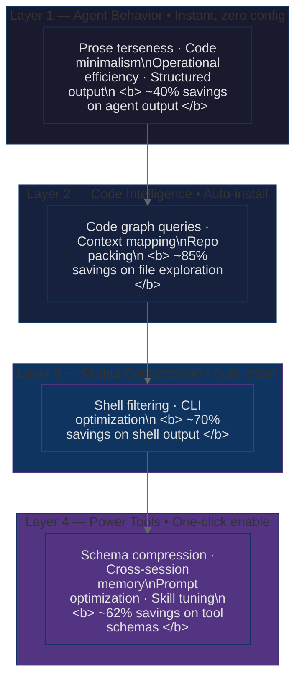

# Token Saver Meta

> **"Token Saving for the Masses"**

[](https://www.npmjs.com/package/token-saver-meta)
[](https://pypi.org/project/token-saver-meta)
[](LICENSE)
[](#multi-platform-support)
[](https://www.npmjs.com/package/token-saver-meta)


A meta-package that bundles token-saving tools across ALL layers of LLM token consumption — with zero configuration.

## Why Token Saver Meta?

AI coding agents spend **40–60% of their token budget** reading files and processing verbose output — not solving problems. Token Saver Meta installs a full stack of tools that slash consumption at every layer: agent behavior, code exploration, shell output, and tool schemas. No config. One install. All platforms.


## Architecture

Hybrid across 4 layers:



| Layer | Capabilities | Install |
|-------|-------------|---------|
| **Agent Behavior** | Prose terseness, code minimalism, operational efficiency, structured output | Instant, zero config |
| **Code Intelligence** | Smart navigation, context mapping, repo packing | Auto-install |
| **Output Compression** | Shell filtering, CLI optimization | Auto-install |
| **Power Tools** | Schema compression, cross-session memory, prompt optimization, skill tuning | One-click enable |

Covers all 7 token consumption types: exploration, shell output, agent output, prompt input, repeated knowledge, tool schemas, and instructions.


## Quick Start

```bash
# npm
npx token-saver-meta

# Python
uvx token-saver-meta

# curl (single command, no package manager needed)
curl -fsSL https://raw.githubusercontent.com/Im-Busy/token-saver-meta/main/install.sh | sh
```

Full architecture: [docs/architecture-v2.md](docs/architecture-v2.md)

## Multi-Platform Support

Supports 18 AI coding platforms out of the box:

**Kilo · Claude Code · Codex · Cursor · Cline · Roo Code · Continue.dev · OpenCode · GitHub Copilot · Windsurf · Augment · FactoryAI · Gemini · Hermes · Kiro · Mastra · Pi**

## License

Apache-2.0
